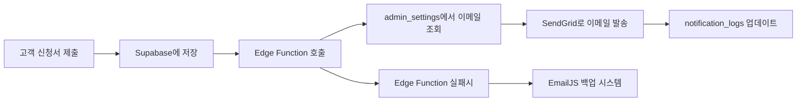

# Supabase Edge Functions 메일 발송 시스템

Supabase Edge Functions를 사용하여 관리자 이메일을 안전하게 발송하는 시스템입니다.

## 🚀 **현재 구현된 기능**

✅ **Supabase Edge Function으로 서버 사이드 메일 발송**  
✅ **데이터베이스에서 관리자 이메일 자동 조회**  
✅ **SendGrid API를 통한 전문적인 HTML 이메일**  
✅ **발송 로그 자동 업데이트 (notification_logs 테이블)**  
✅ **EmailJS 백업 시스템 (Edge Function 실패시 자동 전환)**  
✅ **상세한 오류 처리 및 로깅**  

## 📁 **프로젝트 구조**

```
공사_신청서/
├── supabase/
│   ├── functions/
│   │   └── send-notification/
│   │       └── index.ts          # Edge Function 코드
│   ├── config.toml                # Supabase 설정
│   └── .env.example              # 환경변수 예시
├── script.js                     # 클라이언트 코드 (Edge Function 호출)
└── supabase-config.js            # Supabase 클라이언트 설정
```

## 🛠️ **설정 방법**

### **1. SendGrid 계정 설정**
1. [SendGrid](https://sendgrid.com/) 계정 생성
2. **API Key 생성**:
   - Settings → API Keys → Create API Key
   - Full Access 권한 선택
   - 생성된 API Key 저장 (한 번만 표시됨)

### **2. Supabase CLI 설치**
```bash
# Windows (PowerShell)
scoop install supabase

# macOS
brew install supabase/tap/supabase

# npm (전역 설치)
npm install -g supabase
```

### **3. Supabase 프로젝트 연결**
```bash
# 프로젝트 디렉토리에서 실행
cd 공사_신청서

# Supabase 로그인
supabase login

# 기존 프로젝트와 연결
supabase link --project-ref boorsqnfkwglzvnhtwcx
```

### **4. 환경변수 설정**
Supabase 대시보드에서 설정:
1. **Project Settings** → **Edge Functions** → **Environment Variables**
2. 다음 변수들 추가:

| 변수명 | 값 | 설명 |
|--------|-----|------|
| `SENDGRID_API_KEY` | `SG.xxxxx...` | SendGrid API Key |
| `SUPABASE_SERVICE_ROLE_KEY` | `eyJhbGc...` | 서비스 역할 키 |

### **5. Edge Function 배포**
```bash
# Edge Function 배포
supabase functions deploy send-notification

# 배포 상태 확인
supabase functions list
```

## 📧 **이메일 템플릿**

### **제목 형식**
```
[구포현대아파트] 새 통신환경개선 신청서 - APP-20250906-1234
```

### **HTML 이메일 내용**
- 📡 **헤더**: 구포현대아파트 로고와 제목
- 📋 **신청정보 테이블**: 신청번호, 고객정보, 요청사항
- 💡 **처리 안내**: 관리자 확인 및 연락 요청
- 🔒 **푸터**: 자동발송 안내 및 시스템 정보

## 🔄 **작동 흐름**



## 🛡️ **보안 장점**

| 항목 | EmailJS | Edge Functions |
|------|---------|---------------|
| **API 키 노출** | 클라이언트 노출 | 서버에서만 사용 |
| **발송 권한** | 제한적 | 완전한 제어 |
| **로그 관리** | 외부 서비스 | 자체 DB 관리 |
| **커스터마이징** | 제한적 | 무제한 |
| **비용** | 월 200개 제한 | 무료 (SendGrid 별도) |

## 🧪 **테스트 방법**

### **로컬 테스트**
```bash
# 로컬 Supabase 실행
supabase start

# Edge Function 로컬 실행
supabase functions serve send-notification

# 테스트 호출
curl -X POST http://localhost:54321/functions/v1/send-notification \
  -H "Content-Type: application/json" \
  -d '{"application_id": 1}'
```

### **프로덕션 테스트**
1. 관리자 모드에서 테스트 이메일 등록
2. 고객 모드에서 테스트 신청서 제출
3. 이메일 수신 확인
4. Supabase 대시보드에서 로그 확인

## 📊 **모니터링**

### **Supabase 대시보드에서 확인 가능**
- **Edge Functions Logs**: 함수 실행 로그
- **notification_logs 테이블**: 이메일 발송 상태
- **applications 테이블**: 신청서 접수 현황
- **admin_settings 테이블**: 관리자 설정 현황

### **로그 쿼리 예시**
```sql
-- 최근 이메일 발송 현황
SELECT 
    n.sent_at,
    n.recipient,
    n.status,
    a.application_number,
    a.name as customer_name
FROM notification_logs n
JOIN applications a ON n.application_id = a.id
WHERE n.notification_type = 'email'
ORDER BY n.sent_at DESC
LIMIT 10;
```

## 🔧 **문제해결**

### **Edge Function이 호출되지 않는 경우**
1. **배포 확인**: `supabase functions list`
2. **환경변수 확인**: Supabase 대시보드
3. **권한 확인**: RLS 정책 및 서비스 키

### **이메일이 발송되지 않는 경우**
1. **SendGrid 계정 상태** 확인
2. **API Key 권한** 확인 (Full Access 필요)
3. **발송자 도메인** 인증 상태 확인

### **백업 시스템 (EmailJS) 활용**
- Edge Function 실패시 자동으로 EmailJS로 전환
- 안정성과 가용성 보장
- 개발 단계에서도 안전하게 테스트 가능

## 📈 **향후 확장 가능 기능**

🔄 **카카오톡 알림** 추가  
📱 **SMS 발송** 기능  
📊 **대시보드** 관리 페이지  
🔔 **실시간 알림** 시스템  
📈 **통계 및 리포트** 기능  

현재 시스템은 안정적이고 확장 가능한 기반을 제공합니다! 🚀